# SAP Ticket Management System - Complete System Logic & Flow Pipelines

## 📋 Executive Summary

This document provides a comprehensive overview of the SAP Ticket Management System, detailing all system logic, flow pipelines, and operational procedures. The system automatically creates and manages SAP support tickets from emails using AI analysis, with full Azure AD authentication and Microsoft Graph API integration.

---

## 🏗️ System Architecture Overview

### Core Components

```
┌─────────────────────────────────────────────────────────────────┐
│                    SAP TICKET MANAGEMENT SYSTEM                  │
├─────────────────────────────────────────────────────────────────┤
│                                                                 │
│  ┌─────────────┐    ┌─────────────┐    ┌─────────────┐         │
│  │   FRONTEND  │    │   BACKEND   │    │  DATABASE   │         │
│  │   Next.js   │◄──►│   FastAPI   │◄──►│   SQLite/   │         │
│  │   React     │    │   Python    │    │ PostgreSQL  │         │
│  └─────────────┘    └─────────────┘    └─────────────┘         │
│                                                                 │
│  ┌─────────────┐    ┌─────────────┐    ┌─────────────┐         │
│  │   AZURE AD  │    │ MICROSOFT   │    │     LLM     │         │
│  │   AUTH      │◄──►│   GRAPH     │◄──►│   APIs      │         │
│  │   (MSAL)    │    │   API       │    │ (OpenAI,    │         │
│  └─────────────┘    └─────────────┘    │ Anthropic)  │         │
│                                        └─────────────┘         │
└─────────────────────────────────────────────────────────────────┘
```

### Technology Stack

| Component | Technology | Purpose |
|-----------|------------|---------|
| **Frontend** | Next.js 14, React 18, TypeScript | User interface and client-side logic |
| **Backend** | FastAPI, Python 3.11, Async SQLAlchemy | API server and business logic |
| **Database** | SQLite (dev) / PostgreSQL (prod) | Data persistence |
| **Authentication** | Azure AD, MSAL Browser | SSO authentication |
| **Email Integration** | Microsoft Graph API | Email fetching and processing |
| **AI Processing** | OpenAI, Anthropic, Local LLMs | Email analysis and ticket classification |
| **Deployment** | Docker, Kubernetes | Containerized deployment |

---

## 🔐 Authentication Pipeline

### 1. Frontend Authentication Flow


### 2. Token Validation Logic

```python
# backend/app/middleware/auth_middleware.py
async def verify_azure_token(token: str) -> dict:
    """Validate Azure AD token with Microsoft Graph API"""
    async with httpx.AsyncClient() as client:
        response = await client.get(
            "https://graph.microsoft.com/v1.0/me",
            headers={"Authorization": f"Bearer {token}"}
        )
        if response.status_code != 200:
            raise HTTPException(status_code=401, detail="Invalid token")
        return response.json()

async def get_current_user(token, db) -> CurrentUser:
    """Get or create user from Azure AD data"""
    user_data = await verify_azure_token(token)
    azure_id = user_data.get("id")

    # Check if user exists in DB
    user_repo = UserRepository(db)
    db_user = await user_repo.get_by_azure_id(azure_id)

    if not db_user:
        # Create new user
        db_user = await user_repo.create({
            "azure_id": azure_id,
            "email": user_data.get("mail"),
            "name": user_data.get("displayName"),
            "department": user_data.get("department"),
            "is_active": True,
            "is_admin": False
        })

    return CurrentUser(
        id=db_user.id,
        azure_id=azure_id,
        email=user_data.get("mail"),
        name=user_data.get("displayName"),
        is_admin=db_user.is_admin
    )
```

### 3. Authorization Rules

| User Type | Permissions |
|-----------|-------------|
| **Regular User** | Create tickets, view own tickets, update assigned tickets |
| **Admin User** | All user permissions + user management, system analytics, email processing control |
| **System User** | Auto-created tickets, internal operations only |

---

## 🎫 Ticket Creation Pipelines

### Pipeline 1: Manual Ticket Creation


#### Detailed Logic Flow

```python
# 1. Frontend Form Submission
# frontend-up/src/app/(dashboard)/tickets/new/page.tsx
const handleSubmit = async (e) => {
    const ticketData = {
        title: formData.title,
        description: formData.description,
        module: formData.category,  // SAP module
        priority: formData.priority,
        assignedTo: user?.name,
        raisedBy: user?.name,
        createdBy: user?.name
    };

    const response = await createTicket(ticketData);
    if (response.success) {
        router.push(`/tickets/${response.data.id}`);
    }
};

# 2. API Client Call
# frontend-up/src/lib/ticket-service.ts
export async function createTicket(payload: CreateTicketPayload) {
    const response = await ticketsApi.createTicket({
        title: payload.title,
        description: payload.description,
        priority: payload.priority,
        category: payload.module,
        assigned_to: payload.assignedToId
    });
    return response;
}

# 3. Backend Route Handler
# backend/app/routes/ticket_routes.py
@router.post("", response_model=TicketResponse)
async def create_ticket(
    ticket_data: TicketCreate,
    current_user: CurrentUser = Depends(get_current_user),
    db: AsyncSession = Depends(get_db)
):
    controller = TicketController(db)
    return await controller.create_ticket(ticket_data, current_user)

# 4. Controller Logic
# backend/app/controllers/ticket_controller.py
async def create_ticket(self, ticket_data, current_user):
    return await self.ticket_service.create_ticket(ticket_data, current_user)

# 5. Service Business Logic
# backend/app/services/ticket_service.py
async def create_ticket(self, ticket_data, current_user):
    # Generate unique ticket ID
    ticket_id = await self.ticket_repo.get_next_ticket_id()

    # Create ticket record
    ticket = await self.ticket_repo.create({
        "ticket_id": ticket_id,
        "title": ticket_data.title,
        "description": ticket_data.description,
        "status": TicketStatus.OPEN,
        "priority": ticket_data.priority,
        "category": ticket_data.category,
        "created_by": current_user.id,
        "assigned_to": ticket_data.assigned_to
    })

    # Create audit log
    await self._create_log(
        ticket_id=ticket.id,
        user_id=current_user.id,
        log_type=LogType.CREATED,
        action=f"Ticket {ticket_id} created"
    )

    # Load complete ticket data with relationships
    ticket = await self.ticket_repo.get_with_details(ticket.id)

    # Sync with frontend
    await self.update_frontend_tickets_file()

    return TicketResponse.model_validate(ticket)
```

---

## 📧 Email Processing Pipeline

### Pipeline 2: Email-to-Ticket Automation

```mermaid
flowchart TD
    A[User Clicks Sync Button] --> B[API Call: POST /emails/fetch]
    B --> C[Authentication Check]
    C --> D[EmailController.trigger_email_fetch]
    D --> E[EmailProcessor.process_daily_emails]
    E --> F[EmailService.fetch_emails_with_token]
    F --> G[Microsoft Graph API Call]
    G --> H[Email Batch Received]
    H --> I{For Each Email}
    I --> J[Check Deduplication]
    J --> K{Email Exists?}
    K -->|Yes| L[Skip Email]
    K -->|No| M[Store Email in DB]
    M --> N[Mark as Unprocessed]
    N --> O[EmailProcessor._process_single_email]
    O --> P[LLMService.analyze_email]
    P --> Q[AI Analysis Result]
    Q --> R{Is SAP Related?}
    R -->|No| S[Mark as Skipped]
    R -->|Yes| T{Confidence ≥ 60%?}
    T -->|No| S
    T -->|Yes| U[Create Ticket from Email]
    U --> V[Mark Email as Processed]
    V --> W[Update Statistics]
    W --> X[Return Processing Results]
```



#### Email Processing Logic

```python
# backend/app/services/email_processor.py
async def process_daily_emails(self, days_back=1, max_emails=100, auto_create_tickets=True):
    """Main email processing pipeline"""
    stats = {"fetched": 0, "analyzed": 0, "sap_related": 0, "tickets_created": 0}

    # 1. Fetch emails from Microsoft Graph API
    new_emails = await self.email_service.fetch_emails_with_token(
        access_token=self.current_token,
        days_back=days_back,
        max_emails=max_emails
    )
    stats["fetched"] = len(new_emails)

    # 2. Process each unprocessed email
    unprocessed = await self.email_service.get_unprocessed_emails(limit=max_emails)

    for email in unprocessed:
        result = await self._process_single_email(
            email_id=email.id,
            subject=email.subject,
            body=email.body_text or "",
            from_address=email.from_address,
            auto_create_ticket=auto_create_tickets
        )

        stats["analyzed"] += 1
        if result.get("is_sap_related"):
            stats["sap_related"] += 1
            if result.get("ticket_created"):
                stats["tickets_created"] += 1

    return stats

async def _process_single_email(self, email_id, subject, body, from_address, auto_create_ticket):
    """Process individual email through AI pipeline"""
    # 1. LLM Analysis
    analysis = await self.llm_service.analyze_email(subject, body, from_address)

    result = {
        "email_id": email_id,
        "is_sap_related": analysis.is_sap_related,
        "category": analysis.detected_category.value if analysis.detected_category else None,
        "confidence": analysis.confidence
    }

    # 2. Decision Logic
    if analysis.is_sap_related and auto_create_ticket and analysis.confidence >= 0.6:
        ticket = await self._create_ticket_from_analysis(
            email_id, subject, body, from_address, analysis
        )
        result["ticket_created"] = True
        result["ticket_id"] = ticket.id if ticket else None

    # 3. Mark email as processed
    await self.email_service.mark_processed(
        email_id=email_id,
        is_sap_related=analysis.is_sap_related,
        detected_category=result["category"],
        llm_analysis=analysis.raw_response,
        ticket_created_id=result.get("ticket_id")
    )

    return result
```

---

## 🤖 AI/LLM Integration Pipeline

### Pipeline 3: Email Analysis and Classification

```mermaid
flowchart TD
    A[Email Content Received] --> B[LLMService.analyze_email]
    B --> C[Preprocess Content]
    C --> D[Select AI Provider]
    D --> E{SAP Keywords Found?}
    E -->|Yes| F[Send to Primary LLM]
    E -->|No| G[Use Fallback Analysis]
    F --> H[AI Analysis Response]
    H --> I[Parse Response]
    I --> J[Extract Classification]
    J --> K[Calculate Confidence Score]
    K --> L[Return Analysis Result]
    L --> M[Decision Engine]
    M --> N{Confidence ≥ 60%?}
    N -->|Yes| O[Proceed with Ticket Creation]
    N -->|No| P[Mark as Low Confidence]
```



#### LLM Analysis Logic

```python
# backend/app/services/llm_service.py
class LLMService:
    async def analyze_email(self, subject: str, body: str, from_address: str):
        """Analyze email for SAP relevance and ticket creation"""

        # 1. Preprocessing
        content = self._preprocess_content(subject, body, from_address)

        # 2. Provider Selection Logic
        provider = self._select_provider(content)

        # 3. AI Analysis
        if provider == "openai":
            response = await self._call_openai(content)
        elif provider == "anthropic":
            response = await self._call_anthropic(content)
        else:
            response = await self._fallback_analysis(content)

        # 4. Response Parsing
        analysis = self._parse_response(response)

        return EmailAnalysis(
            is_sap_related=analysis.get("is_sap_related", False),
            detected_category=analysis.get("category"),
            suggested_title=analysis.get("title"),
            suggested_priority=analysis.get("priority"),
            key_points=analysis.get("key_points", []),
            confidence=analysis.get("confidence", 0.0),
            raw_response=response
        )

    def _select_provider(self, content: str) -> str:
        """Select best AI provider based on content characteristics"""
        sap_keywords = ["sap", "mm", "sd", "fico", "pp", "qm", "pm", "wm"]

        if any(keyword in content.lower() for keyword in sap_keywords):
            return "openai"  # Primary for SAP content

        if len(content) > 1000:
            return "anthropic"  # Better for long content

        return "openai"  # Default

    async def _call_openai(self, content: str) -> dict:
        """Call OpenAI API with SAP-specific prompts"""
        prompt = f"""
        Analyze this email for SAP system support ticket creation:

        Email Content:
        {content}

        Determine:
        1. Is this related to SAP systems? (yes/no)
        2. Which SAP module? (MM, SD, FICO, PP, QM, PM, WM, BASIS, ABAP, OTHER)
        3. Suggested ticket title (max 100 chars)
        4. Priority level (LOW, MEDIUM, HIGH, CRITICAL)
        5. Key points to include in ticket
        6. Confidence score (0.0 to 1.0)

        Respond in JSON format.
        """

        response = await openai.ChatCompletion.create(
            model="gpt-4",
            messages=[{"role": "user", "content": prompt}],
            temperature=0.1
        )

        return json.loads(response.choices[0].message.content)
```

---

## 🗄️ Database Operations Pipeline

### Pipeline 4: Data Persistence and Retrieval

```mermaid
flowchart TD
    A[API Request] --> B[get_db() Dependency]
    B --> C[AsyncSession Created]
    C --> D[Repository Method Called]
    D --> E[SQLAlchemy Query Built]
    E --> F[Database Execution]
    F --> G[Results Processed]
    G --> H[Model Validation]
    H --> I[Return Data]
    I --> J[Session Committed/Rolled Back]
    J --> K[Session Closed]
```

#### Repository Pattern Implementation

```python
# backend/app/repositories/base_repository.py
class BaseRepository(Generic[ModelType]):
    def __init__(self, model: Type[ModelType], db: AsyncSession):
        self.model = model
        self.db = db

    async def create(self, obj_in: dict) -> ModelType:
        """Create new record"""
        db_obj = self.model(**obj_in)
        self.db.add(db_obj)
        await self.db.flush()
        await self.db.refresh(db_obj)
        return db_obj

    async def get_by_id(self, id: int) -> Optional[ModelType]:
        """Retrieve by ID with eager loading"""
        result = await self.db.execute(
            select(self.model).where(self.model.id == id)
        )
        return result.scalar_one_or_none()

# backend/app/repositories/ticket_repository.py
class TicketRepository(BaseRepository[Ticket]):
    async def get_next_ticket_id(self) -> str:
        """Generate sequential ticket ID"""
        result = await self.db.execute(
            select(func.count()).select_from(Ticket)
        )
        count = result.scalar_one()
        return f"T-{str(count + 1).zfill(3)}"

    async def get_with_details(self, id: int) -> Optional[Ticket]:
        """Get ticket with all relationships"""
        result = await self.db.execute(
            select(Ticket)
            .options(
                selectinload(Ticket.created_by_user),
                selectinload(Ticket.assigned_to_user),
                selectinload(Ticket.logs).selectinload(TicketLog.user),
                selectinload(Ticket.comments).selectinload(TicketComment.author),
                selectinload(Ticket.attachments)
            )
            .where(Ticket.id == id)
        )
        return result.scalar_one_or_none()
```

---

## 🔄 Frontend-Backend Synchronization Pipeline

### Pipeline 5: Data Sync and State Management


#### Synchronization Logic

```python
# backend/app/services/ticket_service.py
async def update_frontend_tickets_file(self):
    """Sync database tickets to frontend format"""
    try:
        # Get all tickets with relationships
        tickets = await self.ticket_repo.get_all_with_details()

        # Transform to frontend format
        frontend_tickets = []
        for ticket in tickets:
            frontend_ticket = {
                "id": ticket.id,
                "ticketId": ticket.ticket_id,
                "title": ticket.title,
                "description": ticket.description,
                "status": ticket.status.value,
                "priority": ticket.priority.value,
                "category": ticket.category.value,
                "createdOn": ticket.created_at.isoformat(),
                "updatedOn": ticket.updated_at.isoformat(),
                "createdBy": ticket.created_by_user.name if ticket.created_by_user else "Unknown",
                "assignedTo": ticket.assigned_to_user.name if ticket.assigned_to_user else "Unassigned",
                "sourceEmail": ticket.source_email_from if ticket.source_email_from else None,
                "llmConfidence": ticket.llm_confidence,
                "comments": len(ticket.comments) if ticket.comments else 0,
                "logs": len(ticket.logs) if ticket.logs else 0
            }
            frontend_tickets.append(frontend_ticket)

        # Write to frontend file
        file_path = Path("../../frontend-up/src/data/tickets2.ts")
        with open(file_path, 'w', encoding='utf-8') as f:
            f.write(f"export const ticketsData = {json.dumps(frontend_tickets, indent=2)};")

        print(f"✅ Synced {len(frontend_tickets)} tickets to frontend")

    except Exception as e:
        print(f"❌ Frontend sync failed: {e}")
```

```typescript
// frontend-up/src/hooks/useTickets.ts
export function useTickets() {
    const [tickets, setTickets] = useState<Ticket[]>([]);
    const [isLoading, setIsLoading] = useState(true);

    // Load tickets from API
    const loadTickets = useCallback(async () => {
        try {
            setIsLoading(true);
            const response = await getAllTickets();
            setTickets(response);
        } catch (error) {
            console.error('Failed to load tickets:', error);
        } finally {
            setIsLoading(false);
        }
    }, []);

    // Auto-sync every 30 seconds
    useEffect(() => {
        loadTickets(); // Initial load

        const interval = setInterval(() => {
            loadTickets();
        }, 30000); // 30 seconds

        return () => clearInterval(interval);
    }, [loadTickets]);

    return { tickets, isLoading, loadTickets };
}
```

---

## 🚨 Error Handling and Recovery Pipeline

### Pipeline 6: Error Management


#### Error Handling Logic

```python
# backend/app/services/ticket_service.py
async def create_ticket(self, ticket_data, current_user):
    try:
        # Main logic...
        return TicketResponse.model_validate(ticket)

    except Exception as e:
        print(f"❌ Ticket creation failed: {e}")

        # Database error fallback
        if "database" in str(e).lower():
            print("🔄 Falling back to file storage...")
            return await self._create_ticket_in_file(ticket_data, current_user)

        # Re-raise other errors
        raise HTTPException(
            status_code=500,
            detail="Failed to create ticket"
        )

# backend/app/services/email_processor.py
async def _process_single_email(self, email_id, subject, body, from_address, auto_create_ticket):
    try:
        # LLM analysis...
        analysis = await self.llm_service.analyze_email(subject, body, from_address)

    except Exception as e:
        print(f"❌ LLM analysis failed for email {email_id}: {e}")

        # Fallback to mock analysis
        if not self.use_mock:
            from app.services.llm_service import MockLLMService
            mock_llm = MockLLMService(self.db)
            analysis = await mock_llm.analyze_email(subject, body, from_address)
            print(f"🔄 Using fallback keyword analysis for email {email_id}")
        else:
            raise  # Re-raise if already using mock services
```

---

## 📊 Business Logic Rules

### Ticket Creation Rules

1. **Manual Tickets**:
   - Title: Required, 5-200 characters
   - Description: Required, 10-5000 characters
   - Priority: LOW, MEDIUM, HIGH, CRITICAL
   - Category: SAP modules (MM, SD, FICO, etc.)
   - Status: Always starts as OPEN

2. **Email-Generated Tickets**:
   - Must be SAP-related (LLM confidence ≥ 60%)
   - Title: Auto-generated or truncated from email subject
   - Description: Email content + metadata
   - Priority: LLM-suggested or MEDIUM default
   - Category: LLM-detected SAP module

### Email Processing Rules

1. **Deduplication**:
   - Check `internetMessageId` or `id` from Graph API
   - Skip if already exists in `email_sources` table
   - Unique constraint on `message_id` field

2. **SAP Detection**:
   - LLM analysis for SAP relevance
   - Keyword fallback if LLM fails
   - Confidence threshold: 60%

3. **Ticket Auto-Creation**:
   - Only for SAP-related emails
   - High confidence required
   - System user as creator

### User Management Rules

1. **Azure AD Integration**:
   - Auto-create users on first login
   - Sync user info from Microsoft Graph
   - Department and role mapping

2. **Permissions**:
   - Regular users: Own tickets + assigned tickets
   - Admins: All tickets + user management
   - System: Auto-generated tickets only

---

## 🔧 Configuration and Environment Pipeline

### Pipeline 7: System Configuration


#### Configuration Files

```python
# backend/app/core/config.py
class Settings(BaseSettings):
    """Application settings"""

    # Application
    app_name: str = "SAP Ticket Management System"
    app_version: str = "1.0.0"
    debug: bool = True

    # Database
    @property
    def database_url(self) -> str:
        return "sqlite+aiosqlite:///./ticket.db"

    # Azure AD
    azure_client_id: str = ""
    azure_tenant_id: str = ""
    azure_client_secret: str = ""

    # LLM APIs
    openai_api_key: str = ""
    anthropic_api_key: str = ""

    # Email settings
    email_fetch_days_back: int = 1
    email_max_batch_size: int = 100
    llm_confidence_threshold: float = 0.6
```

```typescript
// frontend-up/src/lib/api-config.ts
export const API_BASE_URL = process.env.NEXT_PUBLIC_API_URL || 'http://localhost:8000/api/v1';

export const API_ENDPOINTS = {
  auth: {
    login: '/auth/login',
    me: '/auth/me',
    verify: '/auth/verify',
  },
  tickets: {
    list: '/tickets',
    create: '/tickets',
    get: (id: number) => `/tickets/${id}`,
  },
  // ... more endpoints
};
```

---

## 📈 Monitoring and Analytics Pipeline

### Pipeline 8: System Monitoring


#### Analytics Implementation

```python
# backend/app/services/analytics_service.py
class AnalyticsService:
    async def get_dashboard_stats(self) -> dict:
        """Get comprehensive dashboard statistics"""
        return {
            "tickets": await self._get_ticket_stats(),
            "emails": await self._get_email_stats(),
            "users": await self._get_user_stats(),
            "performance": await self._get_performance_metrics()
        }

    async def _get_ticket_stats(self) -> dict:
        """Ticket statistics by status, priority, category"""
        # Query database for ticket metrics
        total_tickets = await self.ticket_repo.get_count()

        status_breakdown = {}
        for status in TicketStatus:
            count = await self.ticket_repo.get_count_by_status(status)
            status_breakdown[status.value] = count

        return {
            "total": total_tickets,
            "by_status": status_breakdown,
            "by_priority": await self._get_priority_breakdown(),
            "by_category": await self._get_category_breakdown(),
            "recent_activity": await self._get_recent_activity()
        }
```

---

## 🚀 Deployment and Scaling Pipeline

### Pipeline 9: Production Deployment


#### Docker Configuration

```dockerfile
# backend/Dockerfile
FROM python:3.11-slim

WORKDIR /app

# Install dependencies
COPY requirements.txt .
RUN pip install -r requirements.txt

# Copy application
COPY . .

# Database setup
RUN python -c "from app.core.database import create_tables; create_tables()"

# Start application
CMD ["uvicorn", "app.main:app", "--host", "0.0.0.0", "--port", "8000"]
```

```dockerfile
# frontend-up/Dockerfile
FROM node:18-alpine

WORKDIR /app

# Install dependencies
COPY package*.json ./
RUN npm ci

# Copy application
COPY . .

# Build application
RUN npm run build

# Start application
CMD ["npm", "start"]
```

---

## 🔍 Troubleshooting and Recovery

### Common Issues and Solutions

1. **Backend Startup Failures**:
   - Check Azure AD credentials in `.env`
   - Verify database file permissions
   - Check Python dependencies

2. **Authentication Issues**:
   - Clear browser session storage
   - Check Azure AD app registration
   - Verify token expiration

3. **Email Processing Failures**:
   - Check Microsoft Graph API permissions
   - Verify LLM API keys
   - Check email server connectivity

4. **Database Issues**:
   - Run database migrations
   - Check SQLite file integrity
   - Verify connection strings

### Recovery Procedures

```bash
# Backend recovery
cd backend
python -c "from app.core.database import create_tables; create_tables()"
python run.py

# Frontend recovery
cd frontend-up
rm -rf .next node_modules
npm install
npm run build
npm start

# Database recovery
sqlite3 ticket.db ".read ../database/schema.sql"
python -c "from app.core.database import seed_database; seed_database()"
```

---

## 📋 System Health Checks

### Health Check Endpoints

```python
# backend/app/routes/health_routes.py
@router.get("/health")
async def health_check(db: AsyncSession = Depends(get_db)):
    """Comprehensive health check"""
    health_status = {
        "status": "healthy",
        "timestamp": datetime.utcnow().isoformat(),
        "checks": {}
    }

    # Database check
    try:
        await db.execute(text("SELECT 1"))
        health_status["checks"]["database"] = "healthy"
    except Exception as e:
        health_status["checks"]["database"] = f"unhealthy: {e}"
        health_status["status"] = "unhealthy"

    # Azure AD check
    try:
        # Test token validation
        health_status["checks"]["azure_ad"] = "healthy"
    except Exception as e:
        health_status["checks"]["azure_ad"] = f"unhealthy: {e}"

    # LLM services check
    try:
        # Test LLM connectivity
        health_status["checks"]["llm_services"] = "healthy"
    except Exception as e:
        health_status["checks"]["llm_services"] = f"unhealthy: {e}"

    return health_status
```

---

## 🎯 Performance Optimization

### Optimization Strategies

1. **Database Optimization**:
   - Proper indexing on frequently queried fields
   - Connection pooling with SQLAlchemy
   - Async database operations

2. **API Optimization**:
   - Response caching
   - Pagination for large datasets
   - Background job processing for heavy operations

3. **Frontend Optimization**:
   - Code splitting and lazy loading
   - Image optimization
   - Service worker caching

4. **Email Processing Optimization**:
   - Batch processing
   - Parallel LLM calls
   - Deduplication to prevent redundant processing

---

## 🔒 Security Measures

### Security Pipeline


### Security Implementations

1. **Authentication**: Azure AD SSO with token validation
2. **Authorization**: Role-based access control (RBAC)
3. **Input Validation**: Pydantic models with strict validation
4. **SQL Injection Prevention**: SQLAlchemy ORM with parameterized queries
5. **XSS Protection**: React's built-in XSS prevention
6. **Rate Limiting**: FastAPI middleware for request throttling
7. **Audit Logging**: Comprehensive logging of all operations
8. **Data Encryption**: Sensitive data encryption at rest

---

This comprehensive documentation covers the complete system logic, all flow pipelines, business rules, error handling, and operational procedures for the SAP Ticket Management System. The system is designed for reliability, scalability, and maintainability with proper separation of concerns and comprehensive monitoring capabilities.</content>
<parameter name="filePath">c:\Dash_Board_Project\SYSTEM_LOGIC_AND_FLOWS.md